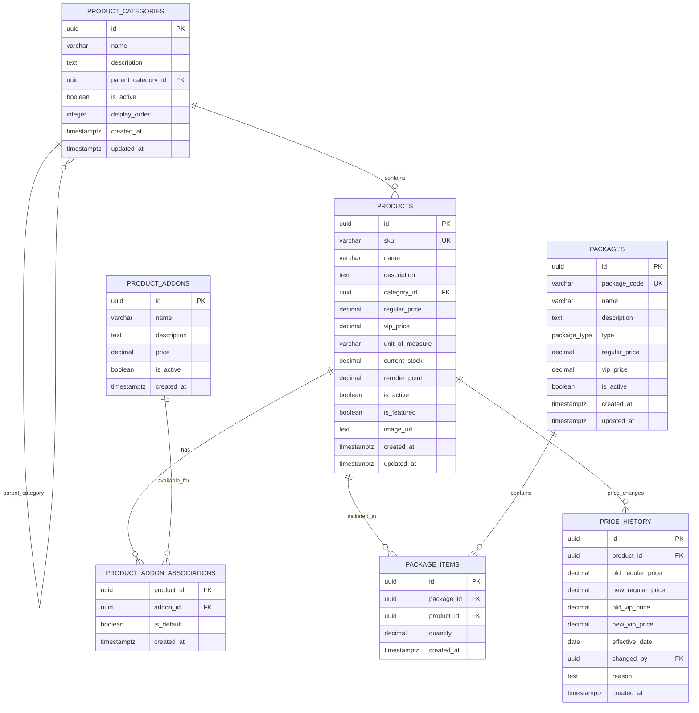

# BeerHive Database - Entity Relationship Diagram

## Visual Overview

This document provides visual representations of the database schema using Mermaid diagrams.

---

## Core System Architecture

```mermaid
graph TB
    subgraph "User Management"
        Users[👥 users<br/>5 rows]
    end
    
    subgraph "Product Catalog"
        Products[🍺 products]
        Categories[📁 product_categories]
        Addons[➕ product_addons]
        Packages[📦 packages]
        
        Categories -->|parent_category_id| Categories
        Products -->|category_id| Categories
        Products -.->|associations| Addons
        Packages -.->|package_items| Products
    end
    
    subgraph "Customer Management"
        Customers[👤 customers]
        Events[🎂 customer_events]
        
        Events -->|customer_id| Customers
    end
    
    subgraph "Table & Sessions"
        Tables[🪑 restaurant_tables]
        Sessions[📋 order_sessions<br/>2 active]
        
        Tables -->|current_session_id| Sessions
        Sessions -->|table_id| Tables
    end
    
    subgraph "Order Processing"
        CurrentOrders[🛒 current_orders<br/>Active]
        Orders[✅ orders<br/>Completed]
        Kitchen[👨‍🍳 kitchen_orders]
        
        CurrentOrders -.->|complete| Orders
        Orders -->|generates| Kitchen
    end
    
    subgraph "Notifications"
        Notifs[🔔 notifications]
    end
    
    Users -->|cashier_id| CurrentOrders
    Users -->|cashier_id| Orders
    Users -->|assigned_to| Kitchen
    Customers -->|customer_id| Orders
    Customers -->|customer_id| Sessions
    Products -->|product_id| Orders
    Tables -->|table_id| Orders
    Sessions -->|session_id| Orders
    Orders -.->|triggers| Notifs
    Kitchen -.->|triggers| Notifs
    Products -.->|triggers| Notifs
```

---

## Complete Entity Relationship Diagram

### Legend
- **Solid lines** → Direct foreign key relationships
- **Dashed lines** → Indirect or trigger-based relationships
- **Numbers in parentheses** → Current row count

---

## 1. User & Authentication Module

---

## 2. Product Management Module

---

## 3. Customer Management Module

---

## 4. Table & Session Management Module

---

## 5. Order Processing Module (Current Orders)

---

## 6. Order Processing Module (Completed Orders)

---

## 7. Inventory Management Module

---

## 8. Notification System

---

## 9. System Configuration

---

## Data Flow Diagrams

### Order Flow

### Notification Flow

### Kitchen Flow

---

## Security Model

```mermaid
flowchart TB
    subgraph "Row Level Security"
        A[User Request] --> B{Authenticated?}
        B -->|No| C[❌ Access Denied]
        B -->|Yes| D{Check RLS Policy}
        
        D --> E{Policy Type}
        E -->|SELECT| F[Can View?]
        E -->|INSERT| G[Can Create?]
        E -->|UPDATE| H[Can Modify?]
        E -->|DELETE| I[Can Delete?]
        
        F --> J{Owns Record OR Has Role?}
        G --> J
        H --> J
        I --> J
        
        J -->|Yes| K[✅ Access Granted]
        J -->|No| C
    end
```

---

## System Architecture

```mermaid
graph TB
    subgraph "Client Layer"
        WebApp[🌐 Web App]
        Mobile[📱 Mobile App]
    end
    
    subgraph "API Layer"
        Supabase[Supabase API]
        Auth[Supabase Auth]
        Realtime[Supabase Realtime]
    end
    
    subgraph "Database Layer"
        PostgreSQL[(PostgreSQL 14+)]
        RLS[Row Level Security]
        Triggers[Triggers & Functions]
    end
    
    subgraph "Data Storage"
        Tables[35 Tables]
        Indexes[100+ Indexes]
        Types[16 Custom Types]
    end
    
    WebApp --> Supabase
    Mobile --> Supabase
    Supabase --> Auth
    Supabase --> Realtime
    Supabase --> PostgreSQL
    PostgreSQL --> RLS
    PostgreSQL --> Triggers
    PostgreSQL --> Tables
    Tables --> Indexes
    Tables --> Types
```

---

## Performance Optimization Strategy

---

**Generated:** 2025-10-09  
**Version:** 2.0  
**Format:** Mermaid Diagrams
